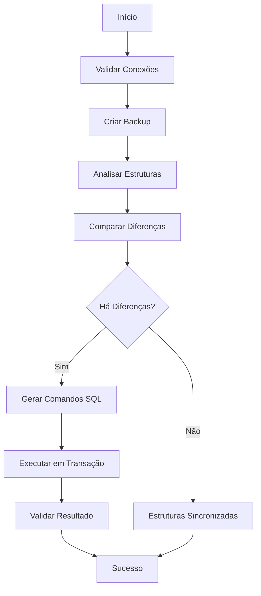

# MySQL/MariaDB Structure Replicator - Documentação Técnica

## Visão Geral

O **MySQL/MariaDB Structure Replicator** é uma aplicação Python desenvolvida para replicação segura de estruturas de banco de dados entre ambientes MySQL/MariaDB. A ferramenta foi projetada com foco em segurança, confiabilidade e preservação da integridade dos dados.

## Arquitetura do Sistema

### Estrutura de Diretórios

```
replicator/
├── main.py                 # Arquivo principal da aplicação
├── requirements.txt        # Dependências Python
├── config/                 # Módulo de configurações
│   ├── __init__.py
│   └── settings.py         # Gerenciamento de configurações e SQLite
├── database/               # Módulos de banco de dados
│   ├── __init__.py
│   ├── connection_manager.py    # Gerenciamento de conexões
│   ├── structure_analyzer.py   # Análise de estruturas
│   └── replicator.py           # Engine de replicação
├── utils/                  # Utilitários
│   ├── __init__.py
│   ├── logger.py           # Sistema de logging
│   ├── menu.py             # Interface de menus
│   └── security.py         # Validações de segurança
├── tests/                  # Testes unitários
│   ├── __init__.py
│   └── test_replicator.py
├── logs/                   # Arquivos de log (criado automaticamente)
├── backups/                # Backups automáticos (criado automaticamente)
├── install.bat/.sh         # Scripts de instalação
├── run.bat/.sh             # Scripts de execução
└── CONFIG_EXAMPLES.md      # Exemplos de configuração
```

## Componentes Principais

### 1. Main Application (`main.py`)

**Responsabilidades:**
- Coordenação geral da aplicação
- Interface principal com o usuário
- Orquestração dos módulos

**Fluxo Principal:**
1. Inicialização dos componentes
2. Exibição do menu principal
3. Processamento das escolhas do usuário
4. Coordenação das operações

### 2. Configuration Management (`config/settings.py`)

**Responsabilidades:**
- Gerenciamento do banco SQLite interno
- Criptografia/descriptografia de senhas
- Armazenamento seguro de configurações de conexão
- Log de operações

**Segurança:**
- Senhas criptografadas com `cryptography.Fernet`
- Chave de criptografia única por instalação
- Validação de parâmetros de entrada

### 3. Connection Manager (`database/connection_manager.py`)

**Responsabilidades:**
- Gerenciamento de conexões MySQL/MariaDB
- Teste e validação de conectividade
- Configuração assistida de conexões
- Execução segura de queries

**Características:**
- Pool de conexões otimizado
- Timeout configurável
- Tratamento robusto de erros
- Suporte a transações

### 4. Structure Analyzer (`database/structure_analyzer.py`)

**Responsabilidades:**
- Análise detalhada de estruturas de banco
- Comparação entre estruturas fonte e destino
- Identificação de diferenças
- Preservação da ordem das colunas

**Análises Realizadas:**
- Estrutura de tabelas e colunas
- Tipos de dados e propriedades
- Índices e chaves primárias
- Chaves estrangeiras
- Comentários e metadados

### 5. Replicator Engine (`database/replicator.py`)

**Responsabilidades:**
- Execução da replicação de estrutura
- Criação de backups automáticos
- Geração de comandos SQL seguros
- Validação pós-replicação

**Processo de Replicação:**
1. Validação de conexões
2. Backup automático do destino
3. Análise e comparação de estruturas
4. Geração de comandos DDL
5. Execução em transação
6. Validação do resultado

### 6. Security Validator (`utils/security.py`)

**Responsabilidades:**
- Validação de comandos SQL
- Verificação de permissões
- Sanitização de identificadores
- Prevenção de ataques de injeção SQL

**Controles de Segurança:**
- Lista de comandos proibidos
- Validação de padrões SQL
- Verificação de nomes de objetos
- Log de eventos de segurança

### 7. Logger System (`utils/logger.py`)

**Responsabilidades:**
- Logging estruturado de operações
- Rotação automática de logs
- Diferentes níveis de log
- Interface colorida para terminal

**Níveis de Log:**
- INFO: Operações normais
- SUCCESS: Operações bem-sucedidas
- WARNING: Avisos e alertas
- ERROR: Erros e falhas
- DEBUG: Informações técnicas

### 8. Menu Interface (`utils/menu.py`)

**Responsabilidades:**
- Interface de usuário baseada em terminal
- Menus interativos
- Validação de entrada
- Exibição formatada de dados

## Fluxo de Operação

### Configuração Inicial

1. **Instalação de Dependências**
   ```bash
   pip install -r requirements.txt
   ```

2. **Primeira Execução**
   - Criação automática de diretórios
   - Inicialização do banco SQLite
   - Geração de chave de criptografia

3. **Configuração de Conexões**
   - Banco de origem (teste/desenvolvimento)
   - Banco de destino (produção)
   - Teste automático de conectividade

### Processo de Replicação



### Segurança e Confiabilidade

#### Backups Automáticos
- Backup completo antes de qualquer modificação
- Múltiplos formatos de backup (mysqldump + manual)
- Timestamp único para cada backup
- Verificação de integridade

#### Transações
- Todas as modificações em transação única
- Rollback automático em caso de erro
- Validação pré e pós-execução
- Log detalhado de todas as operações

#### Validações
- Conexões testadas antes de operações
- Comandos SQL validados contra lista de segurança
- Permissões verificadas automaticamente
- Nomes de objetos sanitizados

## Limitações Conhecidas

### Por Design (Segurança)
- **Não remove** colunas ou tabelas existentes
- **Não modifica** dados armazenados
- **Não replica** procedures, functions, views
- **Não remove** índices ou constraints

### Técnicas
- Requer `mysqldump` para backup otimizado
- Dependente de permissões adequadas no banco
- Limitado a MySQL/MariaDB
- Interface apenas por terminal

## Requisitos do Sistema

### Software
- Python 3.7 ou superior
- MySQL/MariaDB 5.7 ou superior
- mysqldump (opcional, mas recomendado)

### Permissões de Banco
```sql
-- Mínimas necessárias
GRANT SELECT ON information_schema.* TO 'usuario'@'%';
GRANT SHOW VIEW ON database.* TO 'usuario'@'%';

-- Para replicação
GRANT CREATE, ALTER, INDEX ON database.* TO 'usuario'@'%';

-- Para backup
GRANT SELECT, LOCK TABLES, SHOW VIEW, EVENT, TRIGGER ON database.* TO 'usuario'@'%';
```

### Hardware
- 512MB RAM mínimo
- 1GB espaço em disco para logs/backups
- Conexão de rede estável com os bancos

## Configuração Avançada

### Variáveis de Ambiente
```bash
# Opcional: diretório customizado para logs
export REPLICATOR_LOGS_DIR="/custom/logs/path"

# Opcional: timeout de conexão (segundos)
export REPLICATOR_TIMEOUT=30

# Opcional: nível de log
export REPLICATOR_LOG_LEVEL=INFO
```

### Configurações SQLite
O banco SQLite interno armazena:
- Configurações de conexão (senhas criptografadas)
- Histórico de operações
- Configurações gerais da aplicação

Localização: `config/replicator.db`

## Solução de Problemas

### Problemas Comuns

1. **Erro de Importação de Módulos**
   ```
   ModuleNotFoundError: No module named 'pymysql'
   ```
   **Solução:** Execute `pip install -r requirements.txt`

2. **Erro de Conexão**
   ```
   pymysql.err.OperationalError: (2003, "Can't connect to MySQL server")
   ```
   **Solução:** Verifique host, porta, firewall e status do MySQL

3. **Erro de Permissão**
   ```
   Access denied for user 'username'@'host'
   ```
   **Solução:** Verifique usuário, senha e permissões do banco

4. **Erro de Backup**
   ```
   mysqldump: command not found
   ```
   **Solução:** Instale mysql-client ou use backup manual

### Logs de Diagnóstico

Os logs são salvos em `logs/replicator_YYYY-MM-DD.log` e contêm:
- Timestamp detalhado de todas as operações
- Comandos SQL executados
- Erros com stack trace completo
- Eventos de segurança

### Modo Debug

Para ativar logs mais detalhados, modifique `utils/logger.py`:
```python
logging.basicConfig(level=logging.DEBUG, ...)
```

## Extensibilidade

### Adicionando Novos Tipos de Banco
1. Criar novo módulo em `database/`
2. Implementar interface compatível
3. Adicionar drivers necessários em `requirements.txt`
4. Atualizar configurações em `config/settings.py`

### Customizando Validações
1. Modificar `utils/security.py`
2. Adicionar novas regras em `SecurityValidator`
3. Atualizar testes em `tests/`

### Adicionando Funcionalidades
1. Seguir arquitetura modular existente
2. Implementar logging adequado
3. Adicionar validações de segurança
4. Criar testes unitários

## Changelog e Versionamento

### Versão 1.0.0
- Replicação básica de estrutura MySQL/MariaDB
- Sistema de backup automático
- Interface de terminal interativa
- Validações de segurança
- Sistema de logs completo

### Roadmap Futuro
- Suporte a PostgreSQL
- Interface web opcional
- Agendamento de replicações
- Notificações por email
- Modo não-interativo para automação

## Contribuição

Para contribuir com o projeto:
1. Faça fork do repositório
2. Crie branch para nova funcionalidade
3. Implemente seguindo padrões existentes
4. Adicione testes unitários
5. Atualize documentação
6. Submeta pull request

## Licença e Suporte

Este software é fornecido "como está", sem garantias. Use por sua conta e risco, sempre testando em ambiente de desenvolvimento primeiro.

Para suporte técnico, consulte os logs da aplicação e a documentação de troubleshooting.
